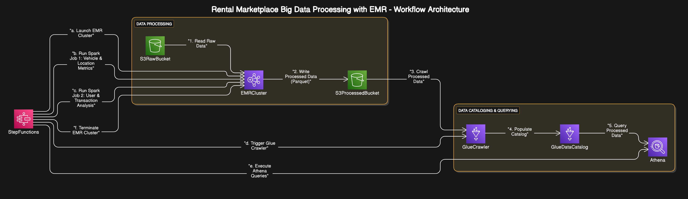

# Big Data Processing with AWS EMR

## Introduction

This documentation provides comprehensive information about the Big Data Processing with AWS EMR project. The project demonstrates how to process large datasets using AWS Elastic MapReduce (EMR) with Apache Spark, and how to integrate with other AWS services like S3, Glue, Athena, and Step Functions to create a complete data pipeline.

The project uses a car rental marketplace dataset as a case study, processing and analyzing data about vehicles, users, locations, and rental transactions to derive business insights.

## Table of Contents

- [Big Data Processing with AWS EMR](#big-data-processing-with-aws-emr)
  - [Introduction](#introduction)
  - [Table of Contents](#table-of-contents)
  - [Project Overview](#project-overview)
  - [Architecture](#architecture)
  - [Setup and Installation](#setup-and-installation)
    - [Prerequisites](#prerequisites)
    - [Installation Steps](#installation-steps)
    - [AWS Resources Setup](#aws-resources-setup)
  - [Project Components](#project-components)
    - [Configuration](#configuration)
    - [Data Processing](#data-processing)
    - [AWS Integration](#aws-integration)
    - [Analysis and Visualization](#analysis-and-visualization)
  - [Usage Guide](#usage-guide)
    - [Running the Pipeline](#running-the-pipeline)
    - [Deployment Options](#deployment-options)
    - [Monitoring](#monitoring)
    - [Cleaning Up](#cleaning-up)
  - [Workflow Guide](#workflow-guide)
    - [Complete Workflow](#complete-workflow)
    - [Execution Order](#execution-order)
    - [Recommended Approaches](#recommended-approaches)
  - [Development Guide](#development-guide)
    - [Project Structure](#project-structure)
    - [Adding New Features](#adding-new-features)
    - [Testing](#testing)
  - [Troubleshooting](#troubleshooting)
    - [Common Issues](#common-issues)
    - [Getting Help](#getting-help)
  - [Project Documentation](#project-documentation)
    - [Setup and Configuration](#setup-and-configuration)
    - [Core Technologies](#core-technologies)
    - [Workflow and Execution](#workflow-and-execution)
    - [Components](#components)
    - [Support](#support)
  - [External References](#external-references)

## Project Overview

The project demonstrates a complete big data processing pipeline using AWS services:

1. **Data Storage**: Raw data is stored in Amazon S3
2. **Data Processing**: Data is processed using Apache Spark on Amazon EMR
3. **Data Cataloging**: Processed data is cataloged using AWS Glue
4. **Data Analysis**: Data is analyzed using Amazon Athena
5. **Workflow Automation**: The entire pipeline is automated using AWS Step Functions

The project processes four datasets from a car rental marketplace:

- **Vehicles Dataset**: Contains information about rental vehicles
- **Users Dataset**: Contains user sign-up information
- **Locations Dataset**: Contains master data for rental locations
- **Rental Transactions Dataset**: Contains records of vehicle rentals

For detailed information about these datasets, including sample data and complete schema, refer to the [Dataset Reference](../data/dataset_reference.md) file.

The data processing extracts key business metrics such as:

- Revenue per location
- Total transactions per location
- Average, max, and min transaction amounts
- Unique vehicles used at each location
- Rental duration and revenue by vehicle type
- User-specific spending and rental duration metrics
- Transaction trends by day, hour, and day of week

## Architecture

The project follows a modern data lake architecture:



The architecture diagram illustrates the flow of data through the system:

1. Raw data is stored in Amazon S3
2. Data is processed using Apache Spark on Amazon EMR
3. Processed data is cataloged using AWS Glue
4. Data is queried using Amazon Athena
5. The entire workflow is orchestrated using AWS Step Functions
6. Business insights are derived from the processed data

The architecture follows these key principles:

- **Decoupling**: Each component has a specific responsibility
- **Scalability**: EMR clusters can scale based on workload
- **Cost Efficiency**: Resources are provisioned only when needed
- **Automation**: The entire pipeline is automated with Step Functions

## Setup and Installation

### Prerequisites

- AWS Account with appropriate permissions
- Python 3.7+
- AWS CLI configured
- Git

### Installation Steps

1. Clone the repository:

   ```bash
   git clone <repository-url>
   cd big-data-emr
   ```

2. Install the required dependencies:

   ```bash
   pip install -r requirements.txt
   ```

3. Configure the environment variables:
   - Copy the `.env.example` file to `.env`
   - Edit the `.env` file with your AWS credentials and configuration:

     ```bash
     # AWS Credentials
     AWS_ACCESS_KEY_ID=your_access_key_here
     AWS_SECRET_ACCESS_KEY=your_secret_key_here
     AWS_REGION=us-east-1

     # S3 Configuration
     S3_BUCKET_NAME=your-bucket-name

     # Other configuration...
     ```

### AWS Resources Setup

The project requires the following AWS resources:

1. **S3 Bucket**: For storing raw and processed data
2. **IAM Roles**:
   - EMR service role
   - EMR EC2 instance profile
   - Glue service role
   - Step Functions execution role
3. **Security Groups**: For EMR cluster

You can set up these resources manually or use the provided scripts:

```bash
python scripts/setup_aws_environment.py
```

## Project Components

### Configuration

The project uses a configuration system based on environment variables for security and flexibility:

- **Environment Variables**: Sensitive configuration is stored in a `.env` file
- **Configuration Modules**: The `config` directory contains modules for loading and accessing configuration

Key configuration files:

- `.env`: Contains sensitive configuration (not in version control)
- `.env.example`: Template for the `.env` file
- `config/env_loader.py`: Loads environment variables
- `config/aws_config.py`: Provides configuration for AWS services
- `config/emr_config.json`: EMR cluster configuration

### Data Processing

The data processing is implemented using Apache Spark on EMR:

- **Spark Jobs**: The `spark` directory contains PySpark jobs for data processing
- **Job 1**: Vehicle and Location Performance Metrics
- **Job 2**: User and Transaction Analysis

The Spark jobs read data from S3, process it, and write the results back to S3 in Parquet format.

### AWS Integration

The project integrates with several AWS services:

- **S3**: For data storage
- **EMR**: For data processing
- **Glue**: For data cataloging
- **Athena**: For data querying
- **Step Functions**: For workflow automation

The integration is implemented using the AWS SDK for Python (boto3) in the `scripts` directory.

### Analysis and Visualization

The project includes Jupyter notebooks for data exploration and analysis:

- **Data Exploration**: Explores the raw datasets
- **Athena Queries**: Demonstrates how to query the processed data using Athena

## Usage Guide

### Running the Pipeline

To run the complete data pipeline:

```bash
python main.py
```

This will:

1. Set up the AWS environment
2. Create an EMR cluster
3. Run Spark jobs on EMR
4. Set up Glue crawlers
5. Deploy Step Functions workflow

### Deployment Options

To only deploy the infrastructure without running jobs:

```bash
python main.py --deploy-only
```

To execute the Step Functions workflow:

```bash
python main.py --run-workflow
```

### Monitoring

You can monitor the pipeline execution in the AWS Management Console:

- **EMR Console**: Monitor the EMR cluster and Spark jobs
- **Glue Console**: Monitor the Glue crawlers
- **Step Functions Console**: Monitor the workflow execution

### Cleaning Up

To clean up the resources when you're done:

```bash
python scripts/terminate_emr_cluster.py <cluster-id>
```

## Workflow Guide

For a detailed guide on the project workflow, including the order in which scripts should be executed, dependencies between components, and recommended approaches for different scenarios, refer to the [Workflow Guide](workflow.md).

For a comprehensive guide on how the Step Functions execution works, including detailed diagrams of the workflow and coordination between different AWS services, refer to the [Step Functions Execution Guide](step_functions_execution_guide.md).

### Complete Workflow

The complete workflow consists of several phases:

1. **Setup Phase** (One-time setup)
   - Set up IAM roles and permissions
   - Set up AWS environment
   - Set up Glue database and crawlers
   - Deploy Step Functions workflow

2. **Data Processing Phase** (Repeatable)
   - Create EMR cluster
   - Run Spark jobs
   - Run Glue crawlers
   - Terminate EMR cluster

3. **Orchestration** (Alternative to manual execution)
   - Execute Step Functions workflow

4. **Analysis Phase**
   - Query data with Athena

### Execution Order

The scripts should be executed in a specific order to ensure all dependencies are met. The [Workflow Guide](workflow.md) provides a detailed execution order diagram using Mermaid and step-by-step instructions.

The diagram visualizes the workflow phases, dependencies between steps, and alternative execution paths using the Step Functions orchestration.

### Recommended Approaches

The [Workflow Guide](workflow.md) provides recommended approaches for different scenarios:

- **For New Setup**: Step-by-step guide for setting up the project from scratch
- **For Regular Data Processing**: Options for manual and automated execution
- **For Development and Testing**: Approaches for local and AWS testing

## Development Guide

### Project Structure

```python
├── README.md                 # Project documentation
├── CHANGELOG.md              # Track project progress
├── ROADMAP.md                # Project roadmap and technical explanations
├── config/                   # Configuration files
│   ├── aws_config.py         # AWS configuration settings
│   ├── env_loader.py         # Environment variable loader
│   └── emr_config.json       # EMR cluster configuration
├── .env                      # Environment variables (not in version control)
├── .env.example              # Template for environment variables
├── data/                     # Sample data (small versions for testing)
│   ├── vehicles/
│   ├── users/
│   ├── locations/
│   └── transactions/
├── notebooks/                # Jupyter notebooks for development and testing
│   ├── data_exploration.ipynb
│   ├── local_spark_testing.ipynb
│   └── athena_queries.ipynb
├── scripts/                  # Shell and Python scripts
│   ├── setup_aws_environment.py
│   ├── create_emr_cluster.py
│   ├── run_spark_jobs.py
│   ├── setup_glue_crawlers.py
│   ├── deploy_step_functions.py
│   ├── execute_step_functions.py
│   ├── terminate_emr_cluster.py
│   └── lambda_start_glue_crawlers.py
├── spark/                    # Spark jobs
│   ├── job1_vehicle_location_metrics.py
│   └── job2_user_transaction_analysis.py
└── step_functions/           # Step Functions workflow definition
    └── data_pipeline_workflow.json
```

### Adding New Features

To add new features to the project:

1. **New Spark Job**:
   - Add a new Python file in the `spark` directory
   - Update the `run_spark_jobs.py` script to include the new job
   - Update the Step Functions workflow to include the new job

2. **New AWS Service Integration**:
   - Add a new configuration section in `aws_config.py`
   - Add a new script in the `scripts` directory
   - Update the main script to include the new integration

### Testing

The project includes several testing approaches:

1. **Local Testing**:
   - Use the Jupyter notebooks for local testing
   - Use a small subset of the data for testing

2. **AWS Testing**:
   - Test individual components on AWS
   - Test the complete pipeline on AWS

## Troubleshooting

### Common Issues

1. **AWS Credentials**:
   - Ensure your AWS credentials are correctly configured in the `.env` file
   - Ensure your IAM user has the necessary permissions

2. **EMR Cluster**:
   - Check the EMR console for cluster status and error messages
   - Check the EMR logs in S3 for detailed error information

3. **Spark Jobs**:
   - Check the Spark logs in the EMR console
   - Use the `--deploy-mode client` option for interactive debugging

4. **Glue Crawlers**:
   - Check the Glue console for crawler status and error messages
   - Ensure the S3 paths are correct

### Getting Help

If you encounter issues:

1. Check the AWS documentation
2. Check the project issues on GitHub
3. Contact the project maintainers

## Project Documentation

This project includes comprehensive documentation on various aspects of the system:

### Setup and Configuration

- [Setup Scripts Guide](setup_scripts.md) - Detailed explanation of the setup scripts and their usage
- [Environment Variables Guide](environment_variables.md) - How environment variables are managed in the project

### Core Technologies

- [PySpark and PyArrow Guide](pyspark_pyarrow_guide.md) - Comprehensive guide to PySpark and PyArrow

### Workflow and Execution

- [Workflow Guide](workflow.md) - Overview of the project workflow and execution order
- [Running Scripts Guide](running_scripts.md) - How to run the various scripts in the project
- [Step Functions Execution Guide](step_functions_execution_guide.md) - Detailed explanation of the Step Functions workflow

### Components

- [AWS Integration Guide](aws_integration.md) - How the project integrates with AWS services
- [Data Processing Guide](data_processing.md) - Details of the data processing pipeline
- [Analysis and Visualization Guide](analysis_visualization.md) - How to analyze and visualize the processed data

### Support

- [Troubleshooting Guide](troubleshooting.md) - Common issues and their solutions

## External References

- [AWS EMR Documentation](https://docs.aws.amazon.com/emr/latest/ManagementGuide/emr-what-is-emr.html)
- [Apache Spark Documentation](https://spark.apache.org/docs/latest/)
- [AWS Glue Documentation](https://docs.aws.amazon.com/glue/latest/dg/what-is-glue.html)
- [AWS Athena Documentation](https://docs.aws.amazon.com/athena/latest/ug/what-is.html)
- [AWS Step Functions Documentation](https://docs.aws.amazon.com/step-functions/latest/dg/welcome.html)
