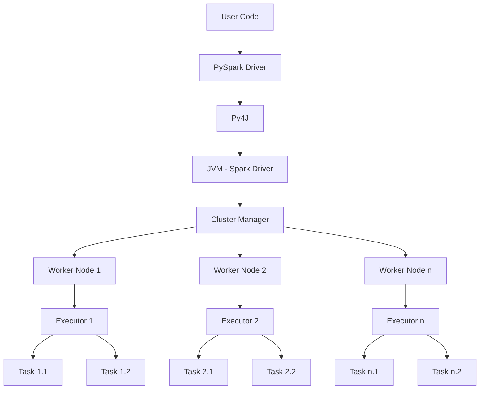
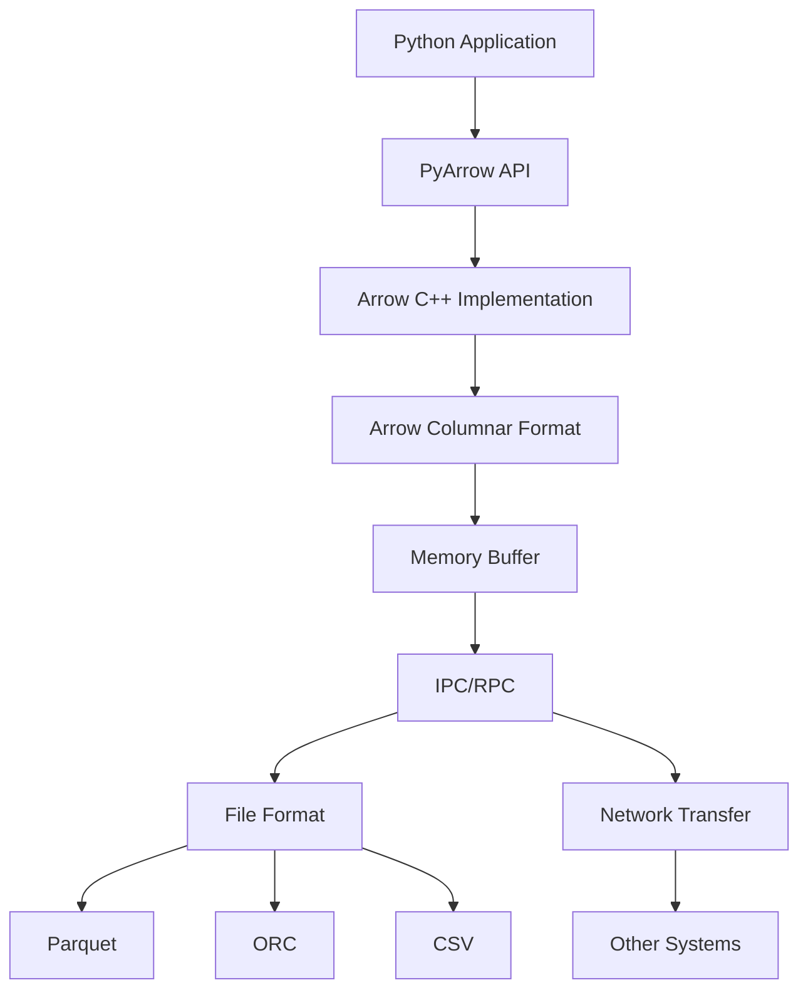
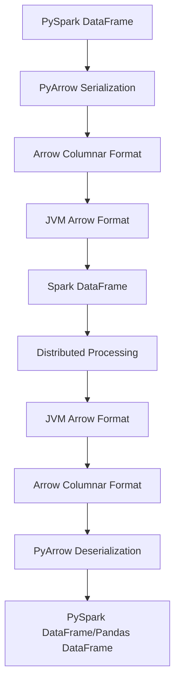

# PySpark and PyArrow: Comprehensive Guide

## Table of Contents

- [PySpark and PyArrow: Comprehensive Guide](#pyspark-and-pyarrow-comprehensive-guide)
  - [Table of Contents](#table-of-contents)
  - [Introduction](#introduction)
  - [PySpark](#pyspark)
    - [What is PySpark?](#what-is-pyspark)
    - [PySpark Architecture](#pyspark-architecture)
    - [Key Components of PySpark](#key-components-of-pyspark)
    - [PySpark DataFrames](#pyspark-dataframes)
    - [RDDs (Resilient Distributed Datasets)](#rdds-resilient-distributed-datasets)
    - [PySpark SQL](#pyspark-sql)
    - [PySpark MLlib](#pyspark-mllib)
    - [PySpark Streaming](#pyspark-streaming)
    - [PySpark GraphX](#pyspark-graphx)
  - [PyArrow](#pyarrow)
    - [What is PyArrow?](#what-is-pyarrow)
    - [PyArrow Architecture](#pyarrow-architecture)
    - [Key Features of PyArrow](#key-features-of-pyarrow)
    - [PyArrow Data Types](#pyarrow-data-types)
    - [Memory Management in PyArrow](#memory-management-in-pyarrow)
  - [Integration Between PySpark and PyArrow](#integration-between-pyspark-and-pyarrow)
    - [How PySpark Uses PyArrow](#how-pyspark-uses-pyarrow)
    - [Performance Benefits](#performance-benefits)
    - [Configuration Options](#configuration-options)
  - [Common Use Cases](#common-use-cases)
    - [Big Data Processing](#big-data-processing)
    - [ETL Pipelines](#etl-pipelines)
    - [Machine Learning Pipelines](#machine-learning-pipelines)
    - [Real-time Analytics](#real-time-analytics)
  - [Best Practices](#best-practices)
    - [PySpark Best Practices](#pyspark-best-practices)
    - [PyArrow Best Practices](#pyarrow-best-practices)
    - [Integration Best Practices](#integration-best-practices)
  - [Performance Tuning](#performance-tuning)
    - [PySpark Performance Tuning](#pyspark-performance-tuning)
    - [PyArrow Performance Tuning](#pyarrow-performance-tuning)
  - [Working with AWS EMR](#working-with-aws-emr)
    - [Setting Up PySpark on EMR](#setting-up-pyspark-on-emr)
    - [Optimizing PyArrow on EMR](#optimizing-pyarrow-on-emr)
    - [S3 Integration](#s3-integration)
  - [Common Challenges and Solutions](#common-challenges-and-solutions)
    - [Memory Management Issues](#memory-management-issues)
    - [Serialization Problems](#serialization-problems)
    - [Performance Bottlenecks](#performance-bottlenecks)
  - [Advanced Topics](#advanced-topics)
    - [Custom UDFs with PyArrow](#custom-udfs-with-pyarrow)
    - [Vectorized UDFs in PySpark](#vectorized-udfs-in-pyspark)
    - [Pandas API on Spark](#pandas-api-on-spark)
  - [Conclusion](#conclusion)

## Introduction

In the world of big data processing, PySpark and PyArrow have emerged as powerful tools that enable efficient data manipulation, analysis, and transfer. This guide provides a comprehensive overview of both technologies, their integration, and best practices for using them effectively, particularly in the context of AWS EMR (Elastic MapReduce).

## PySpark

### What is PySpark?

PySpark is the Python API for Apache Spark, a unified analytics engine for large-scale data processing. It provides a Python interface to Spark, allowing you to leverage Spark's capabilities using Python, a language known for its simplicity and rich ecosystem of data science libraries.

PySpark enables you to perform distributed data processing tasks across clusters of computers, making it possible to handle datasets that are too large to fit on a single machine. It combines the ease of use of Python with the power of Spark's distributed computing framework.

### PySpark Architecture

PySpark follows a master-worker architecture, where a driver program coordinates the execution of tasks across a cluster of worker nodes.



Key components in this architecture:

1. **PySpark Driver**: The Python process that runs your main program and creates the SparkContext.
2. **Py4J**: A bridge that allows Python to communicate with Java/Scala objects in the JVM.
3. **JVM Spark Driver**: The Java Virtual Machine that runs the Spark driver program.
4. **Cluster Manager**: Responsible for resource allocation across the cluster (e.g., YARN, Mesos, or Spark's standalone cluster manager).
5. **Worker Nodes**: Machines in the cluster that execute tasks.
6. **Executors**: JVM processes launched on worker nodes that run tasks and store data.
7. **Tasks**: Individual units of work that are executed on executors.

### Key Components of PySpark

PySpark consists of several key components that provide different functionalities:

1. **PySpark Core**: The foundation of PySpark, providing basic functionality like RDD operations.
2. **PySpark SQL**: Module for structured data processing using DataFrames and SQL queries.
3. **PySpark MLlib**: Library for machine learning algorithms and utilities.
4. **PySpark Streaming**: API for processing real-time data streams.
5. **PySpark GraphX**: API for graph processing and computation.

### PySpark DataFrames

PySpark DataFrames are distributed collections of data organized into named columns, similar to tables in a relational database or DataFrames in pandas. They provide a high-level API for structured data processing.

```python
# Creating a DataFrame from a list
data = [("Alice", 25), ("Bob", 30), ("Charlie", 35)]
columns = ["Name", "Age"]
df = spark.createDataFrame(data, columns)

# Displaying the DataFrame
df.show()
```

DataFrames support a wide range of operations, including filtering, aggregation, joining, and more:

```python
# Filtering data
filtered_df = df.filter(df.Age > 30)

# Aggregating data
avg_age = df.agg({"Age": "avg"}).collect()[0][0]

# Joining DataFrames
df2 = spark.createDataFrame([("Alice", "Engineering"), ("Bob", "Marketing")], ["Name", "Department"])
joined_df = df.join(df2, "Name")
```

### RDDs (Resilient Distributed Datasets)

RDDs are the fundamental data structure in Spark. They are immutable, distributed collections of objects that can be processed in parallel. While DataFrames are now the preferred API for most use cases, understanding RDDs is still important for advanced Spark programming.

```python
# Creating an RDD from a list
data = [1, 2, 3, 4, 5]
rdd = spark.sparkContext.parallelize(data)

# Transforming an RDD
squared_rdd = rdd.map(lambda x: x * x)

# Collecting results
result = squared_rdd.collect()  # [1, 4, 9, 16, 25]
```

RDDs support two types of operations:

1. **Transformations**: Operations that create a new RDD from an existing one (e.g., map, filter, flatMap).
2. **Actions**: Operations that return a value to the driver program after running a computation on the RDD (e.g., collect, count, first).

### PySpark SQL

PySpark SQL allows you to execute SQL queries on your data using either a DataFrame API or SQL syntax:

```python
# Registering a DataFrame as a temporary view
df.createOrReplaceTempView("people")

# Running a SQL query
result = spark.sql("SELECT * FROM people WHERE Age > 30")
result.show()
```

PySpark SQL also provides a wide range of built-in functions for data manipulation:

```python
from pyspark.sql.functions import col, avg, sum, max

# Using DataFrame API with SQL functions
result = df.groupBy("Department").agg(
    avg("Age").alias("avg_age"),
    max("Age").alias("max_age")
)
```

### PySpark MLlib

PySpark MLlib is Spark's machine learning library, providing a wide range of algorithms and utilities for machine learning tasks:

```python
from pyspark.ml.classification import LogisticRegression
from pyspark.ml.feature import VectorAssembler

# Preparing features
assembler = VectorAssembler(inputCols=["feature1", "feature2"], outputCol="features")
data_with_features = assembler.transform(data)

# Training a model
lr = LogisticRegression(maxIter=10, regParam=0.01)
model = lr.fit(data_with_features)

# Making predictions
predictions = model.transform(test_data)
```

MLlib supports various machine learning tasks, including:

- Classification
- Regression
- Clustering
- Collaborative filtering
- Dimensionality reduction
- Feature extraction and transformation

### PySpark Streaming

PySpark Streaming enables processing of real-time data streams:

```python
from pyspark.streaming import StreamingContext

# Creating a streaming context
ssc = StreamingContext(spark.sparkContext, batchDuration=1)

# Creating a DStream from a socket
lines = ssc.socketTextStream("localhost", 9999)

# Processing the stream
word_counts = lines.flatMap(lambda line: line.split(" ")) \
                  .map(lambda word: (word, 1)) \
                  .reduceByKey(lambda a, b: a + b)

# Printing the results
word_counts.pprint()

# Starting the streaming context
ssc.start()
ssc.awaitTermination()
```

### PySpark GraphX

GraphX is Spark's API for graphs and graph-parallel computation. In PySpark, you can use GraphFrames, which is a package that provides DataFrame-based graphs:

```python
from graphframes import GraphFrame

# Creating vertices and edges DataFrames
vertices = spark.createDataFrame([
    ("1", "Alice"), ("2", "Bob"), ("3", "Charlie")
], ["id", "name"])

edges = spark.createDataFrame([
    ("1", "2", "friend"), ("2", "3", "colleague"), ("3", "1", "neighbor")
], ["src", "dst", "relationship"])

# Creating a graph
g = GraphFrame(vertices, edges)

# Running graph algorithms
result = g.pageRank(resetProbability=0.15, tol=0.01)
```

## PyArrow

### What is PyArrow?

PyArrow is the Python implementation of Apache Arrow, a cross-language development platform for in-memory data. It provides a standardized, language-independent columnar memory format for flat and hierarchical data, organized for efficient analytic operations on modern hardware.

PyArrow enables efficient data interchange between different systems and languages, making it particularly valuable in the context of big data processing where data often needs to be transferred between different components of a data pipeline.

### PyArrow Architecture

PyArrow's architecture is centered around the Arrow columnar format, which organizes data in a way that's optimized for analytical operations and efficient data transfer.



Key components in this architecture:

1. **PyArrow API**: The Python interface to Arrow functionality.
2. **Arrow C++ Implementation**: The underlying C++ implementation that PyArrow wraps.
3. **Arrow Columnar Format**: The in-memory data format that organizes data in columns.
4. **Memory Buffer**: The memory management system that handles allocation and deallocation.
5. **IPC/RPC**: Inter-process communication and remote procedure call mechanisms.
6. **File Format**: Support for various file formats like Parquet, ORC, and CSV.
7. **Network Transfer**: Mechanisms for transferring data over the network.

### Key Features of PyArrow

PyArrow provides several key features that make it valuable for data processing:

1. **Efficient Data Interchange**: PyArrow enables zero-copy data interchange between different systems and languages.
2. **Columnar Memory Format**: The columnar format is optimized for analytical operations and SIMD (Single Instruction, Multiple Data) processing.
3. **Integration with Pandas**: PyArrow provides efficient conversion between Pandas DataFrames and Arrow data structures.
4. **File Format Support**: PyArrow supports reading and writing various file formats, including Parquet, ORC, and CSV.
5. **Memory Management**: PyArrow includes a sophisticated memory management system that minimizes copying and maximizes performance.

### PyArrow Data Types

PyArrow supports a wide range of data types, including:

1. **Primitive Types**: Integer, floating-point, boolean, etc.
2. **Temporal Types**: Date, time, timestamp, etc.
3. **Binary Types**: Binary, string, etc.
4. **Nested Types**: List, struct, map, etc.
5. **Union Types**: Dense and sparse unions.

```python
import pyarrow as pa

# Creating PyArrow arrays
int_array = pa.array([1, 2, 3, 4])
float_array = pa.array([1.1, 2.2, 3.3, 4.4])
string_array = pa.array(["a", "b", "c", "d"])

# Creating a PyArrow table
table = pa.Table.from_arrays(
    [int_array, float_array, string_array],
    names=["ints", "floats", "strings"]
)
```

### Memory Management in PyArrow

PyArrow uses a reference-counted memory management system that minimizes copying and maximizes performance. It includes several key components:

1. **Memory Pool**: Manages memory allocation and deallocation.
2. **Buffer**: A contiguous block of memory with a specific data type.
3. **Array**: A sequence of values with a specific data type.
4. **RecordBatch**: A collection of arrays with the same length.
5. **Table**: A collection of record batches with the same schema.

```python
import pyarrow as pa

# Creating a memory pool
pool = pa.default_memory_pool()

# Allocating a buffer
buffer = pa.allocate_buffer(1024, memory_pool=pool)

# Getting memory usage statistics
print(pool.bytes_allocated())  # Total bytes allocated
print(pool.max_memory())       # Maximum memory used
```

## Integration Between PySpark and PyArrow

### How PySpark Uses PyArrow

PySpark uses PyArrow for efficient data transfer between Python and JVM processes. This integration is particularly important for operations that involve converting between Pandas DataFrames and Spark DataFrames.



The integration works as follows:

1. When you convert a Pandas DataFrame to a Spark DataFrame, PySpark uses PyArrow to serialize the Pandas DataFrame into the Arrow columnar format.
2. The Arrow data is then transferred to the JVM, where it's converted to a Spark DataFrame.
3. When you collect a Spark DataFrame to a Pandas DataFrame, the process is reversed: the Spark DataFrame is converted to Arrow format in the JVM, transferred to Python, and deserialized into a Pandas DataFrame using PyArrow.

### Performance Benefits

The integration between PySpark and PyArrow provides several performance benefits:

1. **Reduced Serialization Overhead**: PyArrow's efficient serialization reduces the overhead of transferring data between Python and the JVM.
2. **Columnar Format Advantages**: The columnar format is more efficient for analytical operations and can take advantage of modern CPU features like SIMD.
3. **Zero-Copy Data Transfer**: In many cases, PyArrow can transfer data without copying, further improving performance.
4. **Batch Processing**: PyArrow enables batch processing of data, which is more efficient than row-by-row processing.

### Configuration Options

PySpark provides several configuration options for controlling the PyArrow integration:

```python
# Enable Arrow-based columnar data transfers
spark.conf.set("spark.sql.execution.arrow.pyspark.enabled", "true")

# Set the batch size for Arrow-based columnar data transfers
spark.conf.set("spark.sql.execution.arrow.pyspark.fallback.enabled", "true")

# Enable Arrow-based UDF evaluation
spark.conf.set("spark.sql.execution.arrow.pyspark.udf.enabled", "true")
```

## Common Use Cases

### Big Data Processing

PySpark and PyArrow are particularly well-suited for big data processing tasks, where you need to analyze large datasets that don't fit in the memory of a single machine:

```python
# Reading a large CSV file into a Spark DataFrame
df = spark.read.csv("s3://bucket/large-dataset.csv", header=True, inferSchema=True)

# Performing transformations
result = df.groupBy("category").agg({"value": "sum"})

# Writing the result to Parquet format
result.write.parquet("s3://bucket/result")
```

### ETL Pipelines

PySpark and PyArrow can be used to build efficient ETL (Extract, Transform, Load) pipelines:

```python
# Extract: Reading data from various sources
df1 = spark.read.json("s3://bucket/source1.json")
df2 = spark.read.parquet("s3://bucket/source2.parquet")

# Transform: Cleaning and transforming the data
df1_cleaned = df1.dropna()
df2_cleaned = df2.filter(df2.value > 0)

joined = df1_cleaned.join(df2_cleaned, "id")
transformed = joined.select("id", "name", "value", "category")

# Load: Writing the transformed data to a destination
transformed.write.mode("overwrite").parquet("s3://bucket/destination")
```

### Machine Learning Pipelines

PySpark's MLlib, combined with PyArrow's efficient data transfer, enables building end-to-end machine learning pipelines:

```python
from pyspark.ml import Pipeline
from pyspark.ml.feature import StringIndexer, VectorAssembler
from pyspark.ml.classification import RandomForestClassifier
from pyspark.ml.evaluation import MulticlassClassificationEvaluator

# Preparing the data
indexer = StringIndexer(inputCol="category", outputCol="categoryIndex")
assembler = VectorAssembler(inputCols=["feature1", "feature2", "feature3"], outputCol="features")
classifier = RandomForestClassifier(labelCol="categoryIndex", featuresCol="features")

# Building the pipeline
pipeline = Pipeline(stages=[indexer, assembler, classifier])

# Training the model
model = pipeline.fit(training_data)

# Making predictions
predictions = model.transform(test_data)

# Evaluating the model
evaluator = MulticlassClassificationEvaluator(labelCol="categoryIndex", predictionCol="prediction")
accuracy = evaluator.evaluate(predictions)
```

### Real-time Analytics

PySpark Streaming, combined with PyArrow's efficient data transfer, enables real-time analytics:

```python
from pyspark.streaming import StreamingContext
from pyspark.sql.functions import window

# Creating a streaming context
ssc = StreamingContext(spark.sparkContext, batchDuration=1)

# Creating a DStream from Kafka
df = spark.readStream.format("kafka") \
    .option("kafka.bootstrap.servers", "host:port") \
    .option("subscribe", "topic") \
    .load()

# Processing the stream
query = df.selectExpr("CAST(key AS STRING)", "CAST(value AS STRING)") \
    .groupBy(window(df.timestamp, "1 minute"), "key") \
    .count() \
    .writeStream \
    .outputMode("complete") \
    .format("console") \
    .start()

# Waiting for the query to terminate
query.awaitTermination()
```

## Best Practices

### PySpark Best Practices

1. **Use DataFrames Instead of RDDs**: DataFrames are more efficient and easier to use than RDDs for most use cases.
2. **Leverage Spark SQL**: Spark SQL provides optimized execution plans for queries.
3. **Partition Your Data Appropriately**: Proper partitioning can significantly improve performance.
4. **Cache Intermediate Results**: Use caching to avoid recomputing the same data multiple times.
5. **Use Broadcast Joins for Small Tables**: Broadcast joins can be much more efficient than regular joins for small tables.
6. **Tune Spark Configuration**: Adjust Spark configuration parameters based on your workload and available resources.
7. **Monitor Your Application**: Use Spark UI to monitor your application and identify bottlenecks.

### PyArrow Best Practices

1. **Use Batch Processing**: Process data in batches rather than row by row.
2. **Leverage Zero-Copy Data Transfer**: Use PyArrow's zero-copy data transfer capabilities when possible.
3. **Use Memory Pools**: Use memory pools to manage memory allocation and deallocation.
4. **Choose Appropriate Data Types**: Use the most appropriate data types for your data to minimize memory usage.
5. **Use Compression**: Use compression to reduce memory usage and I/O.
6. **Leverage Parallel Processing**: Use parallel processing to speed up data processing.
7. **Monitor Memory Usage**: Monitor memory usage to avoid out-of-memory errors.

### Integration Best Practices

1. **Enable Arrow-Based Columnar Data Transfers**: Set `spark.sql.execution.arrow.pyspark.enabled` to `true`.
2. **Use Vectorized UDFs**: Use vectorized UDFs to improve performance.
3. **Tune Batch Size**: Adjust the batch size based on your workload and available memory.
4. **Handle Schema Mismatches**: Be aware of schema mismatches between Pandas and Spark DataFrames.
5. **Test Performance**: Test the performance of your application with and without Arrow to ensure it's providing benefits.
6. **Handle Fallbacks**: Configure fallback behavior for cases where Arrow can't be used.
7. **Update to Latest Versions**: Keep PySpark and PyArrow updated to benefit from the latest improvements.

## Performance Tuning

### PySpark Performance Tuning

1. **Memory Management**:
   - Adjust `spark.driver.memory` and `spark.executor.memory` based on your workload.
   - Use `spark.memory.fraction` and `spark.memory.storageFraction` to control memory allocation.

2. **Parallelism**:
   - Adjust `spark.default.parallelism` and `spark.sql.shuffle.partitions` based on your cluster size.
   - Use `repartition` and `coalesce` to control the number of partitions.

3. **Shuffle Optimization**:
   - Use `spark.sql.adaptive.enabled` to enable adaptive query execution.
   - Adjust `spark.sql.shuffle.partitions` based on your workload.

4. **I/O Optimization**:
   - Use appropriate file formats (e.g., Parquet, ORC) for your data.
   - Use compression to reduce I/O.

5. **Join Optimization**:
   - Use broadcast joins for small tables.
   - Use `spark.sql.autoBroadcastJoinThreshold` to control when broadcast joins are used.

### PyArrow Performance Tuning

1. **Memory Management**:
   - Use memory pools to manage memory allocation and deallocation.
   - Monitor memory usage to avoid out-of-memory errors.

2. **Batch Processing**:
   - Process data in batches rather than row by row.
   - Adjust batch size based on your workload and available memory.

3. **Data Type Optimization**:
   - Use the most appropriate data types for your data.
   - Use dictionary encoding for string columns with low cardinality.

4. **Compression**:
   - Use compression to reduce memory usage and I/O.
   - Choose the appropriate compression algorithm based on your workload.

5. **Parallel Processing**:
   - Use parallel processing to speed up data processing.
   - Adjust the number of threads based on your hardware.

## Working with AWS EMR

### Setting Up PySpark on EMR

To set up PySpark on EMR, you can use the EMR console or the AWS CLI:

```bash
aws emr create-cluster \
    --name "PySpark Cluster" \
    --release-label emr-6.4.0 \
    --applications Name=Spark \
    --ec2-attributes KeyName=myKey \
    --instance-type m5.xlarge \
    --instance-count 3 \
    --use-default-roles
```

You can also use a bootstrap action to install additional Python packages:

```bash
aws emr create-cluster \
    --name "PySpark Cluster" \
    --release-label emr-6.4.0 \
    --applications Name=Spark \
    --ec2-attributes KeyName=myKey \
    --instance-type m5.xlarge \
    --instance-count 3 \
    --use-default-roles \
    --bootstrap-actions Path=s3://bucket/bootstrap.sh
```

Where `bootstrap.sh` might look like:

```bash
#!/bin/bash
sudo pip install pyarrow pandas matplotlib seaborn
```

### Optimizing PyArrow on EMR

To optimize PyArrow on EMR, you can:

1. **Install the Latest Version**: Use a bootstrap action to install the latest version of PyArrow.
2. **Configure Memory**: Adjust the memory configuration for PyArrow based on your workload.
3. **Use Appropriate Instance Types**: Choose instance types with sufficient memory and CPU for your workload.
4. **Enable Arrow-Based Columnar Data Transfers**: Set `spark.sql.execution.arrow.pyspark.enabled` to `true`.
5. **Tune Batch Size**: Adjust the batch size based on your workload and available memory.

### S3 Integration

PySpark and PyArrow can be used to read and write data from/to S3:

```python
# Reading data from S3
df = spark.read.parquet("s3://bucket/data.parquet")

# Writing data to S3
df.write.parquet("s3://bucket/result")
```

To optimize S3 access, you can:

1. **Use S3A File System**: Use the S3A file system for better performance.
2. **Enable S3 Guard**: Use S3 Guard to improve metadata performance.
3. **Use Appropriate Partitioning**: Partition your data appropriately to improve query performance.
4. **Use Compression**: Use compression to reduce I/O.
5. **Use Appropriate File Formats**: Use appropriate file formats (e.g., Parquet, ORC) for your data.

## Common Challenges and Solutions

### Memory Management Issues

**Challenge**: Out-of-memory errors when processing large datasets.

**Solutions**:

1. Increase driver and executor memory.
2. Use more partitions to distribute the data.
3. Use more efficient data formats (e.g., Parquet).
4. Use memory pools in PyArrow to manage memory allocation.
5. Process data in smaller batches.

### Serialization Problems

**Challenge**: Slow serialization when transferring data between Python and the JVM.

**Solutions**:

1. Enable Arrow-based columnar data transfers.
2. Use vectorized UDFs.
3. Minimize data transfer between Python and the JVM.
4. Use appropriate data types.
5. Update to the latest versions of PySpark and PyArrow.

### Performance Bottlenecks

**Challenge**: Slow performance due to various bottlenecks.

**Solutions**:

1. Use the Spark UI to identify bottlenecks.
2. Optimize shuffle operations.
3. Use broadcast joins for small tables.
4. Cache intermediate results.
5. Use appropriate partitioning.
6. Tune Spark configuration parameters.
7. Use more efficient data formats.

## Advanced Topics

### Custom UDFs with PyArrow

You can create custom UDFs (User-Defined Functions) that leverage PyArrow for efficient data processing:

```python
from pyspark.sql.functions import pandas_udf
from pyspark.sql.types import DoubleType
import pandas as pd

# Defining a pandas UDF
@pandas_udf(DoubleType())
def multiply(s: pd.Series) -> pd.Series:
    return s * 2

# Using the UDF
df = spark.createDataFrame([(1,), (2,), (3,)], ["value"])
result = df.select(multiply("value").alias("doubled_value"))
```

### Vectorized UDFs in PySpark

Vectorized UDFs use Arrow to transfer data efficiently between Spark and Python:

```python
from pyspark.sql.functions import pandas_udf
from pyspark.sql.types import StructType, StructField, DoubleType
import pandas as pd
import numpy as np

# Defining a vectorized UDF
schema = StructType([
    StructField("mean", DoubleType()),
    StructField("std", DoubleType())
])

@pandas_udf(schema)
def stats(s: pd.Series) -> pd.DataFrame:
    return pd.DataFrame({
        "mean": [s.mean()],
        "std": [s.std()]
    })

# Using the UDF
df = spark.createDataFrame([(1,), (2,), (3,)], ["value"])
result = df.select(stats("value").alias("stats"))
```

### Pandas API on Spark

Spark 3.2 introduced the Pandas API on Spark, which allows you to use pandas-like syntax with Spark:

```python
import pyspark.pandas as ps

# Creating a pandas-on-spark DataFrame
df = ps.DataFrame({"a": [1, 2, 3], "b": [4, 5, 6]})

# Using pandas-like operations
result = df.groupby("a").sum()
```

The Pandas API on Spark uses PyArrow for efficient data transfer between Spark and Python.

## Conclusion

PySpark and PyArrow are powerful tools for big data processing, providing efficient data manipulation, analysis, and transfer capabilities. By understanding their architecture, features, and integration, you can leverage them effectively to build high-performance data processing pipelines.

This guide has covered the fundamentals of PySpark and PyArrow, their integration, common use cases, best practices, performance tuning, and advanced topics. By following these guidelines, you can make the most of these technologies in your big data projects, particularly when working with AWS EMR.
