# AWS Step Functions Comprehensive Guide

## Table of Contents

- [Introduction](#introduction)
- [Architecture Overview](#architecture-overview)
- [Step Functions Workflow Structure](#step-functions-workflow-structure)
- [Parameterization in Step Functions](#parameterization-in-step-functions)
  - [Using JSONPath](#using-jsonpath)
  - [Intrinsic Functions](#intrinsic-functions)
  - [Input and Output Processing](#input-and-output-processing)
- [IAM Roles and Permissions](#iam-roles-and-permissions)
  - [Service-Linked Roles](#service-linked-roles)
  - [Required Permissions](#required-permissions)
  - [Cross-Service Permissions](#cross-service-permissions)
- [Execution Process](#execution-process)
- [Error Handling and Retry Mechanisms](#error-handling-and-retry-mechanisms)
- [Monitoring and Logging](#monitoring-and-logging)
- [Best Practices](#best-practices)
- [Troubleshooting](#troubleshooting)
- [References](#references)

## Introduction

AWS Step Functions is a serverless orchestration service that allows you to coordinate multiple AWS services into structured, visual workflows. Step Functions provides a reliable way to build and run workflows that stitch together services such as AWS Lambda, Amazon EMR, AWS Glue, and many others.

This guide provides a comprehensive overview of AWS Step Functions, focusing on:

1. How to structure and parameterize workflows
2. Required IAM roles and permissions
3. Best practices for implementation
4. Troubleshooting common issues

## Architecture Overview

The following diagram illustrates the high-level architecture of our data processing pipeline orchestrated by AWS Step Functions:

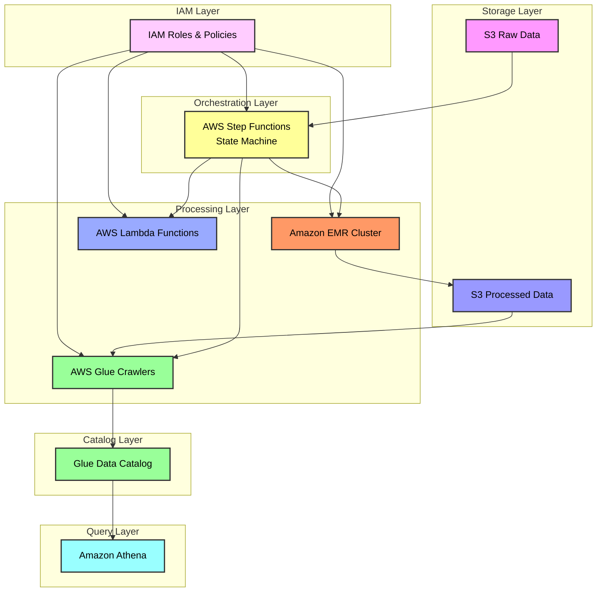

## Step Functions Workflow Structure

AWS Step Functions workflows are defined using Amazon States Language (ASL), a JSON-based language. The workflow consists of a series of states that determine the execution path.

### Visual Representation of Our Workflow

Below is a visual representation of our Car Rental Data Pipeline workflow as seen in the AWS Step Functions console:

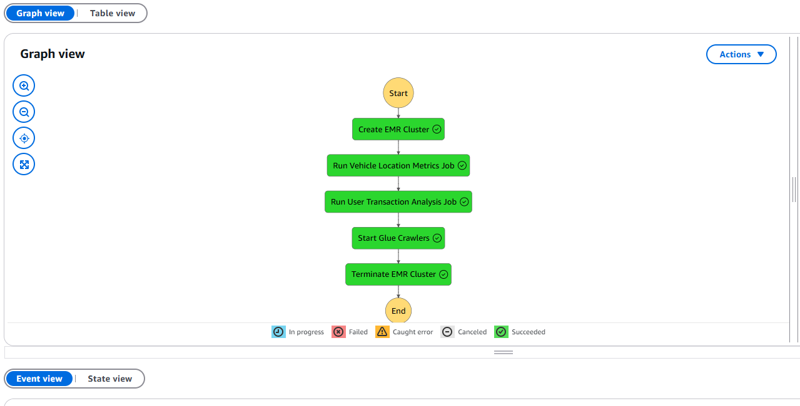

This graph view shows the sequence of states in our workflow, including creating an EMR cluster, running Spark jobs, starting Glue crawlers, and terminating the EMR cluster.

### State Machine Structure

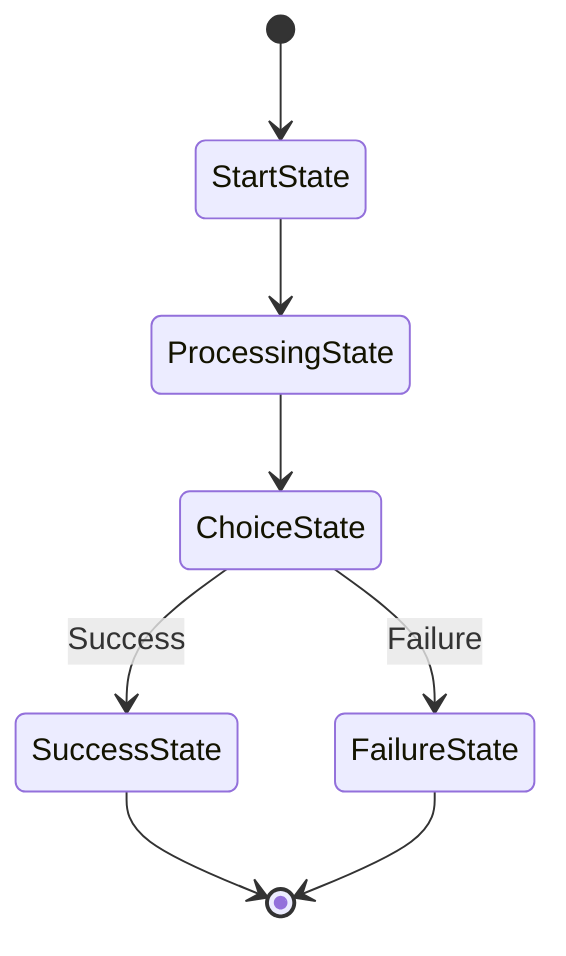

A typical state machine definition looks like this:

```json
{
  "Comment": "A simple AWS Step Functions state machine",
  "StartAt": "FirstState",
  "States": {
    "FirstState": {
      "Type": "Task",
      "Resource": "arn:aws:states:::lambda:invoke",
      "Parameters": {
        "FunctionName": "MyLambdaFunction",
        "Payload.$": "$"
      },
      "Next": "ChoiceState"
    },
    "ChoiceState": {
      "Type": "Choice",
      "Choices": [
        {
          "Variable": "$.status",
          "StringEquals": "SUCCESS",
          "Next": "SuccessState"
        }
      ],
      "Default": "FailureState"
    },
    "SuccessState": {
      "Type": "Succeed"
    },
    "FailureState": {
      "Type": "Fail",
      "Error": "DefaultError",
      "Cause": "An error occurred during execution"
    }
  }
}
```

### State Types

Step Functions supports several state types:

1. **Task**: Performs a specific task, such as invoking a Lambda function or starting an EMR cluster
2. **Choice**: Makes a decision based on input
3. **Parallel**: Executes branches in parallel
4. **Map**: Iterates over an array of items
5. **Wait**: Pauses execution for a specified time
6. **Succeed**: Ends the execution successfully
7. **Fail**: Ends the execution with a failure
8. **Pass**: Passes input to output, optionally transforming the data

## Parameterization in Step Functions

Parameterization allows you to make your Step Functions workflows more flexible and reusable by passing dynamic values at runtime.

### Using JSONPath

Step Functions uses JSONPath to reference and manipulate JSON data. JSONPath expressions start with `$` and can be used to select specific parts of the input data.

```mermaid
flowchart LR
    subgraph "Input JSON"
        Input["{\n  \"data\": {\n    \"value\": 42,\n    \"name\": \"example\"\n  }\n}"]
    end

    subgraph "JSONPath Expressions"
        Path1["$.data.value"]
        Path2["$.data.name"]
    end

    subgraph "Results"
        Result1["42"]
        Result2["\"example\""]
    end

    Input --> Path1
    Input --> Path2
    Path1 --> Result1
    Path2 --> Result2
```

To use JSONPath in your state machine, append `.$` to the parameter name:

```json
"Parameters": {
  "InputValue.$": "$.data.value",
  "InputName.$": "$.data.name"
}
```

### Intrinsic Functions

Step Functions provides several intrinsic functions that can be used to manipulate data within your workflows:

1. **States.Format**: Formats a string using placeholders
2. **States.JsonToString**: Converts a JSON object to a string
3. **States.StringToJson**: Converts a string to a JSON object
4. **States.Array**: Creates an array from the provided values
5. **States.ArrayContains**: Checks if an array contains a specific value
6. **States.ArrayGetItem**: Gets an item from an array at a specific index
7. **States.ArrayLength**: Gets the length of an array
8. **States.ArrayPartition**: Partitions an array into chunks
9. **States.ArrayRange**: Creates an array with a range of numbers
10. **States.ArrayUnique**: Removes duplicate values from an array
11. **States.Base64Decode**: Decodes a Base64-encoded string
12. **States.Base64Encode**: Encodes a string to Base64
13. **States.Hash**: Calculates a hash value
14. **States.JsonMerge**: Merges two JSON objects
15. **States.MathAdd**: Adds two numbers
16. **States.MathRandom**: Generates a random number
17. **States.StringSplit**: Splits a string into an array
18. **States.UUID**: Generates a UUID

Example of using intrinsic functions:

```json
"Parameters": {
  "Message.$": "States.Format('Hello, {}!', $.name)",
  "Items.$": "States.Array('item1', 'item2', $.dynamicItem)"
}
```

### Input and Output Processing

Step Functions provides several fields to control the flow of data through your workflow:

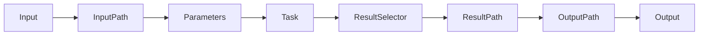

1. **InputPath**: Selects a portion of the state input to pass to the task
2. **Parameters**: Specifies the input parameters for the task
3. **ResultSelector**: Selects a portion of the task result
4. **ResultPath**: Specifies where to store the task result in the state output
5. **OutputPath**: Selects a portion of the state output to pass to the next state

Example:

```json
{
  "Type": "Task",
  "Resource": "arn:aws:states:::elasticmapreduce:createCluster.sync",
  "InputPath": "$.emr",
  "Parameters": {
    "Name.$": "$.cluster_name",
    "ReleaseLabel.$": "$.release_label",
    "ServiceRole.$": "$.service_role"
  },
  "ResultSelector": {
    "ClusterId.$": "$.ClusterId",
    "Status.$": "$.Status.State"
  },
  "ResultPath": "$.cluster",
  "OutputPath": "$",
  "Next": "NextState"
}
```

## IAM Roles and Permissions

AWS Step Functions requires specific IAM roles and permissions to interact with other AWS services.

### Service-Linked Roles

Service-linked roles are predefined IAM roles that are linked to specific AWS services. These roles have the necessary permissions to call other AWS services on your behalf.

For example, EMR requires a service-linked role called `AWSServiceRoleForEMRCleanup` to perform cleanup operations:

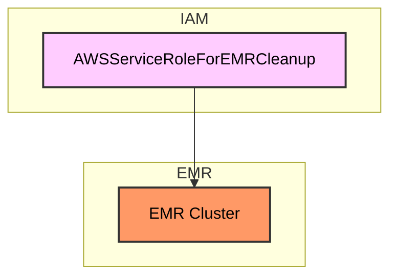

To create a service-linked role:

```python
def create_service_linked_role(service_name: str, region=AWS_REGION) -> bool:
    """
    Create a service-linked role for a specific AWS service.
    """
    iam_client = boto3.client("iam", region_name=region)

    try:
        # Check if the service-linked role already exists
        try:
            iam_client.get_role(
                RoleName=f"AWSServiceRoleFor{service_name.split('.')[0].capitalize()}"
            )
            logger.info(f"Service-linked role for {service_name} already exists")
            return True
        except ClientError as e:
            if e.response["Error"]["Code"] != "NoSuchEntity":
                raise e

        # Create the service-linked role
        iam_client.create_service_linked_role(AWSServiceName=service_name)
        logger.info(f"Service-linked role for {service_name} created successfully")
        return True
    except ClientError as e:
        logger.error(f"Error creating service-linked role for {service_name}: {e}")
        return False
```

### Required Permissions

Step Functions requires different permissions depending on the services it interacts with:

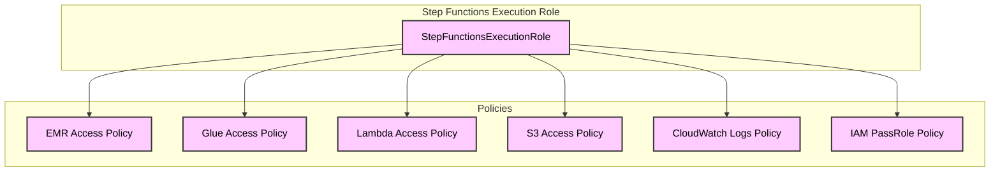

Here are the key policies required for Step Functions:

1. **EMR Access Policy**:
```json
{
  "Version": "2012-10-17",
  "Statement": [
    {
      "Effect": "Allow",
      "Action": [
        "elasticmapreduce:AddJobFlowSteps",
        "elasticmapreduce:AddTags",
        "elasticmapreduce:CancelSteps",
        "elasticmapreduce:CreateJobFlow",
        "elasticmapreduce:DescribeCluster",
        "elasticmapreduce:DescribeStep",
        "elasticmapreduce:RunJobFlow",
        "elasticmapreduce:SetTerminationProtection",
        "elasticmapreduce:TerminateJobFlows"
      ],
      "Resource": "arn:aws:elasticmapreduce:*:*:cluster/*"
    }
  ]
}
```

2. **Glue Access Policy**:
```json
{
  "Version": "2012-10-17",
  "Statement": [
    {
      "Effect": "Allow",
      "Action": [
        "glue:StartCrawler",
        "glue:GetCrawler"
      ],
      "Resource": "arn:aws:glue:*:*:crawler/*"
    }
  ]
}
```

3. **Lambda Access Policy**:
```json
{
  "Version": "2012-10-17",
  "Statement": [
    {
      "Effect": "Allow",
      "Action": [
        "lambda:InvokeFunction"
      ],
      "Resource": "arn:aws:lambda:*:*:function:*"
    }
  ]
}
```

4. **S3 Access Policy**:
```json
{
  "Version": "2012-10-17",
  "Statement": [
    {
      "Effect": "Allow",
      "Action": [
        "s3:GetObject",
        "s3:PutObject",
        "s3:ListBucket"
      ],
      "Resource": [
        "arn:aws:s3:::*/*",
        "arn:aws:s3:::*"
      ]
    }
  ]
}
```

5. **CloudWatch Logs Policy**:
```json
{
  "Version": "2012-10-17",
  "Statement": [
    {
      "Effect": "Allow",
      "Action": [
        "logs:CreateLogDelivery",
        "logs:GetLogDelivery",
        "logs:UpdateLogDelivery",
        "logs:DeleteLogDelivery",
        "logs:ListLogDeliveries",
        "logs:PutResourcePolicy",
        "logs:DescribeResourcePolicies",
        "logs:DescribeLogGroups"
      ],
      "Resource": "*"
    }
  ]
}
```

6. **IAM PassRole Policy**:
```json
{
  "Version": "2012-10-17",
  "Statement": [
    {
      "Effect": "Allow",
      "Action": "iam:PassRole",
      "Resource": "*"
    }
  ]
}
```

### Cross-Service Permissions

When Step Functions interacts with other AWS services, it needs to pass roles to those services. This requires the `iam:PassRole` permission.

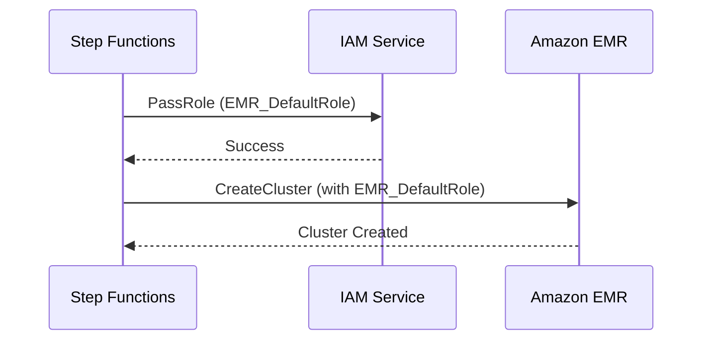

## Execution Process

The execution process of a Step Functions workflow involves several steps:

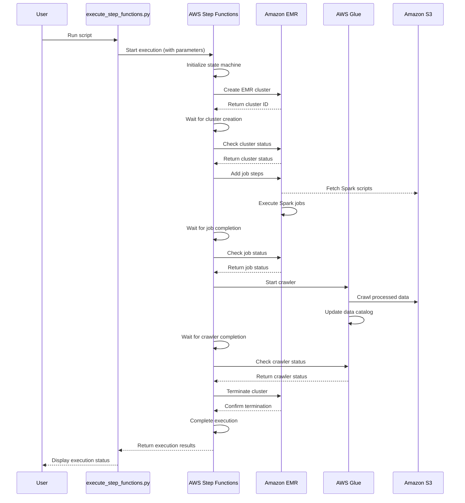

## Error Handling and Retry Mechanisms

Step Functions provides robust error handling and retry mechanisms:

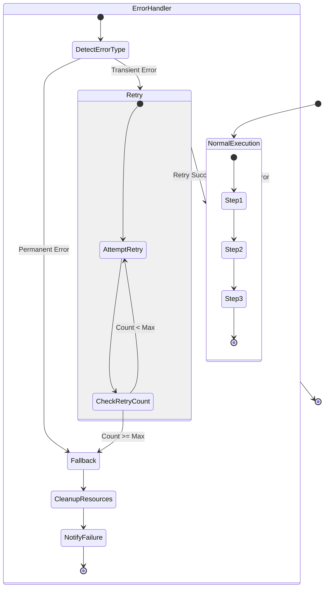

To implement retry logic in your state machine:

```json
{
  "Type": "Task",
  "Resource": "arn:aws:states:::elasticmapreduce:createCluster.sync",
  "Parameters": {
    "Name.$": "$.emr_config.cluster_name",
    "ReleaseLabel.$": "$.emr_config.release_label"
  },
  "Retry": [
    {
      "ErrorEquals": ["States.ALL"],
      "IntervalSeconds": 60,
      "MaxAttempts": 3,
      "BackoffRate": 2.0
    }
  ],
  "Catch": [
    {
      "ErrorEquals": ["States.ALL"],
      "ResultPath": "$.error",
      "Next": "HandleError"
    }
  ],
  "Next": "NextState"
}
```

## Monitoring and Logging

Step Functions integrates with CloudWatch for monitoring and logging:

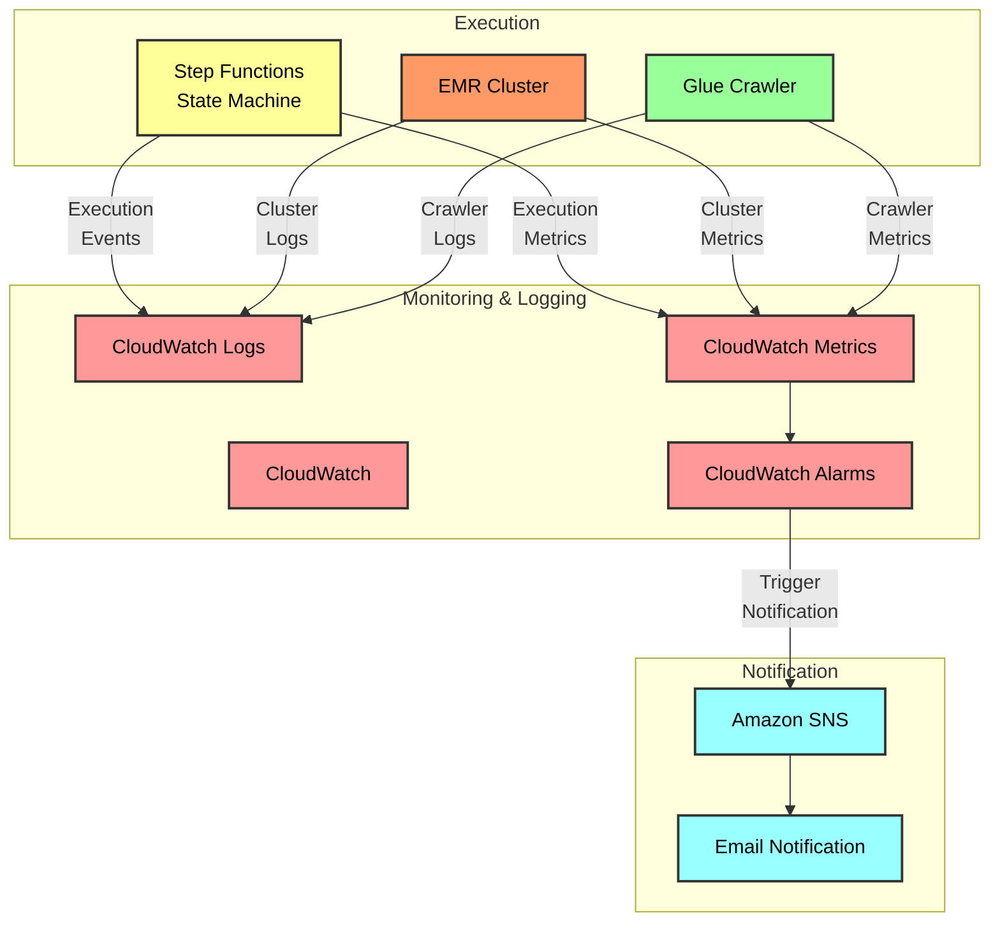

To enable logging for Step Functions:

```python
def create_log_group(log_group_name: str, retention_days: int = 30, region=AWS_REGION) -> bool:
    """
    Create a CloudWatch log group if it doesn't exist.
    """
    logs_client = boto3.client("logs", region_name=region)

    try:
        # Check if log group exists
        try:
            logs_client.describe_log_groups(logGroupNamePrefix=log_group_name)
            logger.info(f"Log group '{log_group_name}' already exists")
        except logs_client.exceptions.ResourceNotFoundException:
            # Create log group
            logs_client.create_log_group(logGroupName=log_group_name)
            logger.info(f"Log group '{log_group_name}' created successfully")

        # Set retention policy
        logs_client.put_retention_policy(
            logGroupName=log_group_name, retentionInDays=retention_days
        )
        logger.info(f"Set retention policy of {retention_days} days for log group '{log_group_name}'")

        return True
    except Exception as e:
        logger.error(f"Error creating/configuring log group '{log_group_name}': {e}")
        return False
```

## Best Practices

When working with Step Functions, follow these best practices:

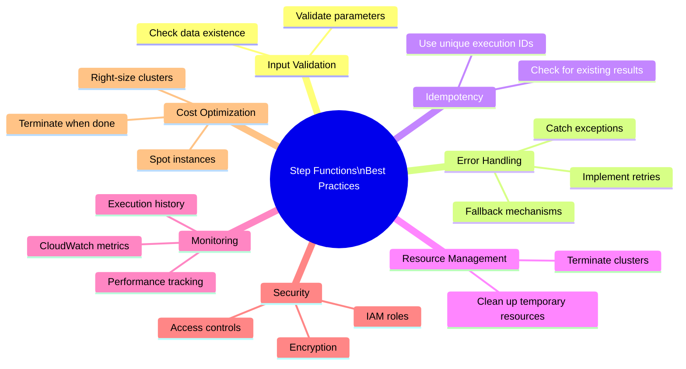

1. **Input Validation**:
   - Validate input parameters before starting the execution
   - Use Choice states to check for required parameters

2. **Error Handling**:
   - Implement comprehensive error handling with Retry and Catch
   - Use different retry strategies for different error types

3. **Idempotency**:
   - Design workflows to be idempotent to avoid duplicate processing
   - Use unique execution IDs for each run

4. **Resource Management**:
   - Ensure resources (especially EMR clusters) are properly terminated
   - Clean up temporary resources after execution

5. **Monitoring**:
   - Set up CloudWatch alarms for execution failures
   - Monitor execution time and resource usage

6. **Security**:
   - Use IAM roles with least privilege principles
   - Encrypt sensitive data in transit and at rest

7. **Cost Optimization**:
   - Terminate EMR clusters when not in use
   - Use spot instances for cost savings
   - Optimize resource usage based on workload

## Troubleshooting

Common issues and their solutions:

1. **Permission Errors**:
   - Issue: "User is not authorized to perform: iam:PassRole"
   - Solution: Add the iam:PassRole permission to the Step Functions execution role

2. **Service-Linked Role Errors**:
   - Issue: "Service-linked role 'AWSServiceRoleForEMRCleanup' for EMR is required"
   - Solution: Create the service-linked role using the IAM console or API

3. **Parameter Errors**:
   - Issue: "Invalid State Machine Definition: SCHEMA_VALIDATION_FAILED"
   - Solution: Check the syntax of your state machine definition, especially for JSONPath expressions and intrinsic functions

4. **Execution Timeout**:
   - Issue: "Execution timed out"
   - Solution: Increase the timeout value for the state machine or optimize the workflow

5. **Resource Limits**:
   - Issue: "Resource limit exceeded"
   - Solution: Request a service limit increase or optimize resource usage

## References

- [AWS Step Functions Documentation](https://docs.aws.amazon.com/step-functions/)
- [Amazon States Language Specification](https://states-language.net/spec.html)
- [AWS IAM Documentation](https://docs.aws.amazon.com/iam/)
- [Amazon EMR Documentation](https://docs.aws.amazon.com/emr/)
- [AWS Glue Documentation](https://docs.aws.amazon.com/glue/)
- [AWS Lambda Documentation](https://docs.aws.amazon.com/lambda/)
- [Amazon S3 Documentation](https://docs.aws.amazon.com/s3/)
- [Amazon CloudWatch Documentation](https://docs.aws.amazon.com/cloudwatch/)
