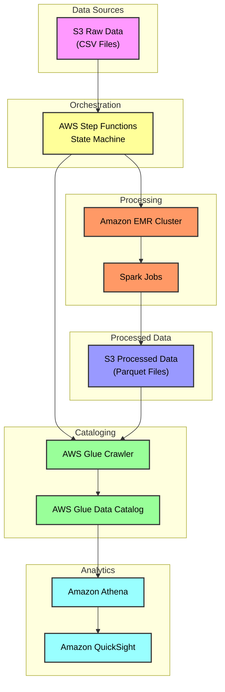
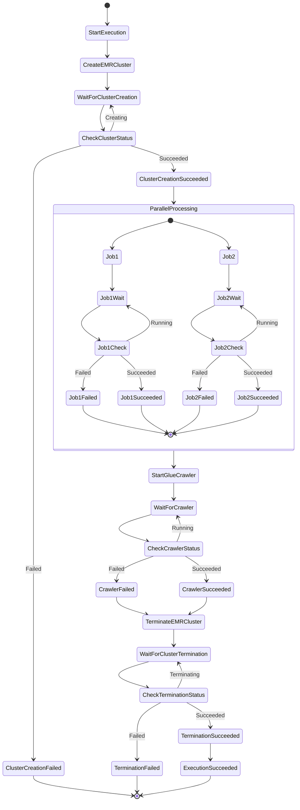
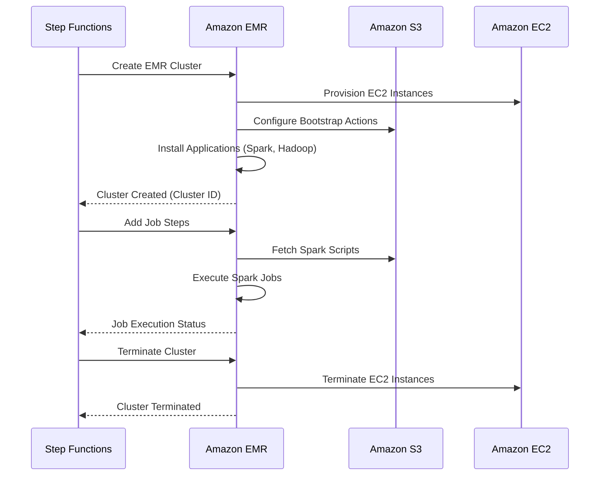
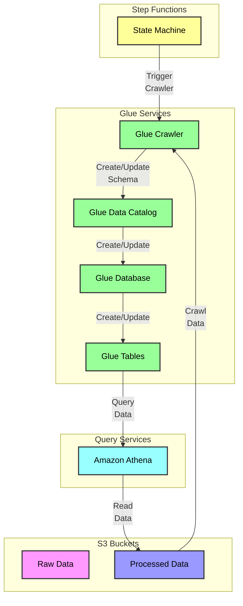
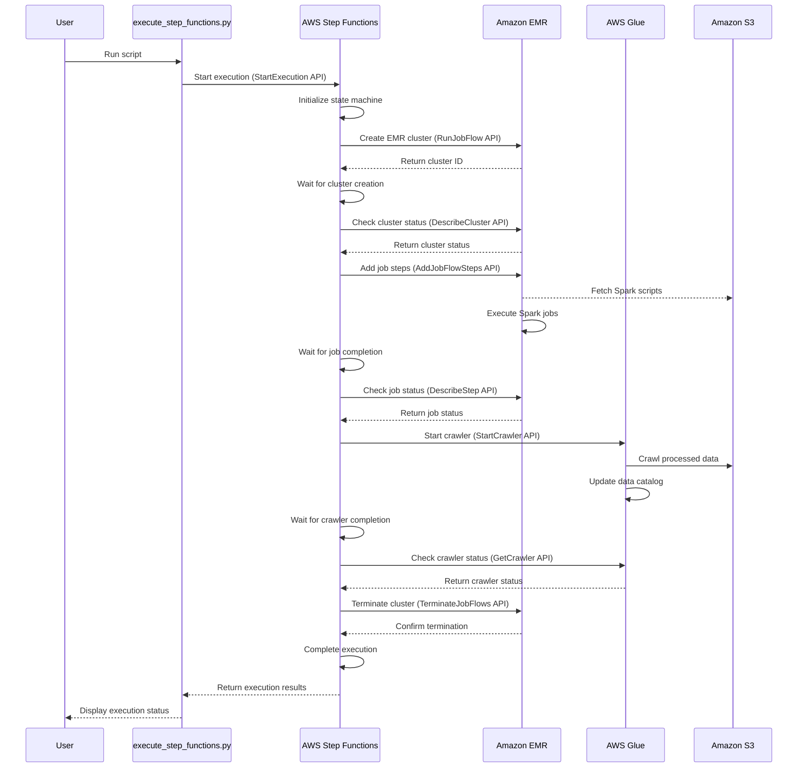
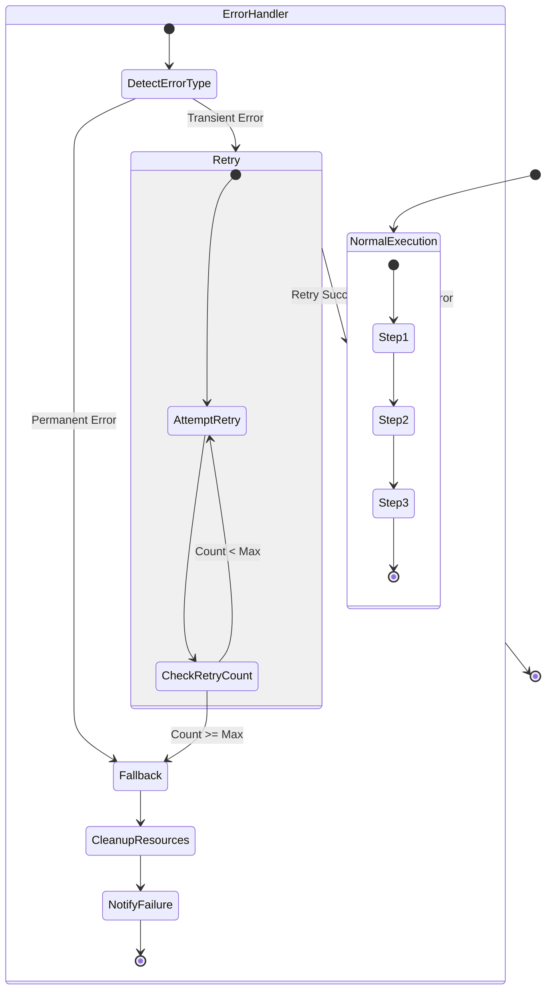
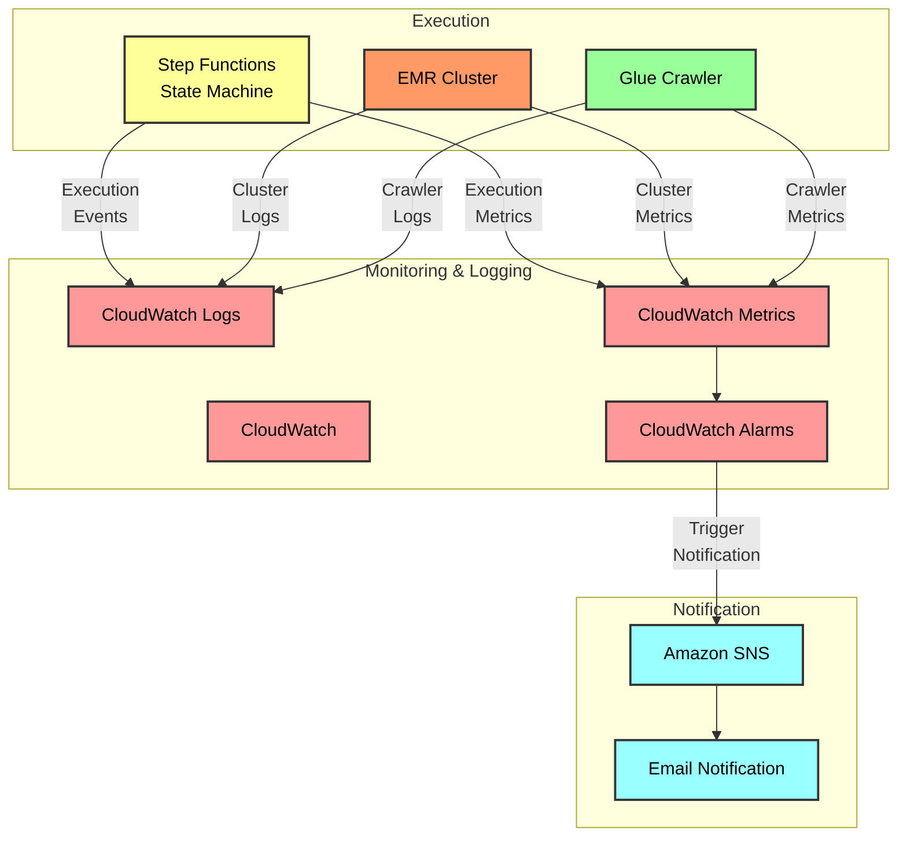
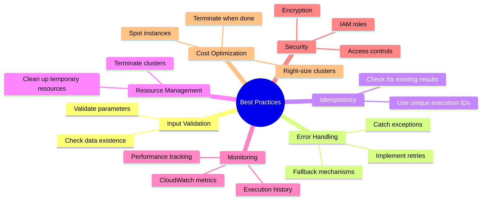

# AWS Step Functions Execution Guide

This document provides a comprehensive overview of how AWS Step Functions orchestrates the data processing pipeline in our Car Rental Data Lake project. It explains the coordination between Step Functions, EMR, Glue, and other AWS services.

## Table of Contents

- [AWS Step Functions Execution Guide](#aws-step-functions-execution-guide)
  - [Table of Contents](#table-of-contents)
  - [Overview](#overview)
  - [Architecture](#architecture)
  - [Step Functions Workflow](#step-functions-workflow)
  - [EMR Cluster Management](#emr-cluster-management)
  - [Glue Crawler Integration](#glue-crawler-integration)
  - [Data Processing Flow](#data-processing-flow)
  - [Execution Process](#execution-process)
  - [Error Handling and Retry Mechanisms](#error-handling-and-retry-mechanisms)
  - [Monitoring and Logging](#monitoring-and-logging)
  - [Best Practices](#best-practices)
  - [Conclusion](#conclusion)

## Overview

AWS Step Functions is a serverless orchestration service that allows you to coordinate multiple AWS services into structured, visual workflows. In our Car Rental Data Lake project, Step Functions orchestrates the entire data processing pipeline, from launching EMR clusters to running Spark jobs and triggering Glue crawlers.

The execution script (`scripts/execute_step_functions.py`) initiates the Step Functions state machine, which then coordinates the execution of various steps in the data processing pipeline.

## Architecture

The following diagram illustrates the high-level architecture of our data processing pipeline:

## Step Functions Workflow

The Step Functions state machine defines the workflow for our data processing pipeline. It consists of multiple states that execute in sequence or in parallel, with conditional branching based on the results of previous steps.

## EMR Cluster Management

Amazon EMR (Elastic MapReduce) is a cloud-based big data platform that runs Apache Spark, Hadoop, and other frameworks to process and analyze vast amounts of data. Our Step Functions workflow manages the EMR cluster lifecycle.

## Glue Crawler Integration

AWS Glue crawlers automatically discover and catalog data stored in S3. Our Step Functions workflow triggers Glue crawlers to catalog the processed data, making it available for querying with Athena.

## Data Processing Flow

The following diagram illustrates the end-to-end data processing flow, from raw data to analytics:

```mermaid
flowchart LR
    subgraph "Data Ingestion"
        Raw["Raw CSV Files"]
        Upload["Upload to S3"]
        style Raw fill:#f9f,stroke:#333,stroke-width:2px,color:#000
        style Upload fill:#f9f,stroke:#333,stroke-width:2px,color:#000
    end
    
    subgraph "Data Processing"
        EMRCluster["EMR Cluster"]
        Job1["Vehicle Location\nMetrics Job"]
        Job2["User Transaction\nAnalysis Job"]
        style EMRCluster fill:#f96,stroke:#333,stroke-width:2px,color:#000
        style Job1 fill:#f96,stroke:#333,stroke-width:2px,color:#000
        style Job2 fill:#f96,stroke:#333,stroke-width:2px,color:#000
    end
    
    subgraph "Data Cataloging"
        Crawler["Glue Crawler"]
        Catalog["Glue Data Catalog"]
        style Crawler fill:#9f9,stroke:#333,stroke-width:2px,color:#000
        style Catalog fill:#9f9,stroke:#333,stroke-width:2px,color:#000
    end
    
    subgraph "Data Storage"
        ProcessedData["Processed Parquet Files"]
        style ProcessedData fill:#99f,stroke:#333,stroke-width:2px,color:#000
    end
    
    subgraph "Data Analytics"
        Athena["Amazon Athena"]
        QuickSight["Amazon QuickSight"]
        style Athena fill:#9ff,stroke:#333,stroke-width:2px,color:#000
        style QuickSight fill:#9ff,stroke:#333,stroke-width:2px,color:#000
    end
    
    Raw --> Upload
    Upload --> EMRCluster
    EMRCluster --> Job1 & Job2
    Job1 & Job2 --> ProcessedData
    ProcessedData --> Crawler
    Crawler --> Catalog
    Catalog --> Athena
    Athena --> QuickSight
```

## Execution Process

The execution process begins with the `execute_step_functions.py` script, which initiates the Step Functions state machine. The following diagram illustrates this process:

## Error Handling and Retry Mechanisms

The Step Functions workflow includes robust error handling and retry mechanisms to ensure reliability:

## Monitoring and Logging

The execution of the Step Functions workflow is monitored and logged through various AWS services:

## Best Practices

When working with Step Functions and the execution script, follow these best practices:

1. **Input Validation**: Always validate input parameters before starting the execution.
2. **Error Handling**: Implement comprehensive error handling in the execution script.
3. **Idempotency**: Design the workflow to be idempotent to avoid duplicate processing.
4. **Resource Cleanup**: Ensure resources (especially EMR clusters) are properly terminated.
5. **Monitoring**: Set up CloudWatch alarms to monitor the execution of the workflow.
6. **Logging**: Enable detailed logging for troubleshooting and auditing.
7. **Security**: Use IAM roles with least privilege principles.
8. **Cost Optimization**: Terminate EMR clusters when not in use to minimize costs.

## Conclusion

The Step Functions execution process orchestrates a complex data processing pipeline that integrates multiple AWS services. By understanding this process, you can effectively monitor, troubleshoot, and optimize the execution of your data processing workflows.

For more information, refer to the following resources:

- [AWS Step Functions Documentation](https://docs.aws.amazon.com/step-functions/)
- [Amazon EMR Documentation](https://docs.aws.amazon.com/emr/)
- [AWS Glue Documentation](https://docs.aws.amazon.com/glue/)
