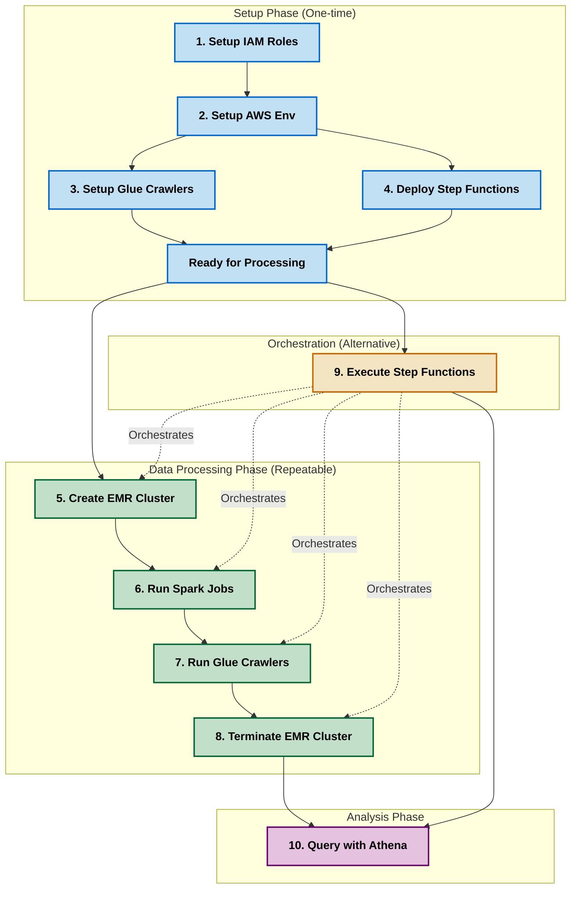

# Project Workflow Guide

This document provides a comprehensive guide to the project workflow, including the order in which scripts should be executed, dependencies between components, and recommended approaches for different scenarios.

## Table of Contents

- [Project Workflow Guide](#project-workflow-guide)
  - [Table of Contents](#table-of-contents)
  - [Overview](#overview)
  - [Complete Workflow](#complete-workflow)
    - [1. Setup Phase (One-time setup)](#1-setup-phase-one-time-setup)
    - [2. Data Processing Phase (Repeatable)](#2-data-processing-phase-repeatable)
    - [3. Orchestration (Alternative to manual execution)](#3-orchestration-alternative-to-manual-execution)
    - [4. Analysis Phase](#4-analysis-phase)
  - [Execution Order Diagram](#execution-order-diagram)
  - [Main Script](#main-script)
  - [Environment Configuration](#environment-configuration)
  - [Recommended Approaches](#recommended-approaches)
    - [For New Setup](#for-new-setup)
    - [For Regular Data Processing](#for-regular-data-processing)
    - [For Development and Testing](#for-development-and-testing)
  - [Monitoring the Workflow](#monitoring-the-workflow)
  - [Troubleshooting Workflow Issues](#troubleshooting-workflow-issues)

## Overview

The project workflow is divided into several phases, each with specific scripts that need to be executed in a particular order. Understanding this workflow is essential for successfully setting up and running the data processing pipeline.

The main phases are:

1. **Setup Phase**: One-time setup of AWS resources
2. **Data Processing Phase**: Repeatable data processing jobs
3. **Orchestration**: Automated execution using Step Functions
4. **Analysis Phase**: Querying and analyzing the processed data

## Complete Workflow

### 1. Setup Phase (One-time setup)

1. **Set up IAM roles and permissions**
   - Script: `scripts/setup_iam_roles.py` (or the wrapper scripts)
   - Purpose: Creates all necessary IAM roles and permissions for EMR, Glue, Lambda, and Step Functions
   - Dependencies: AWS CLI configured with admin access
   - Command:

     ```bash
     python scripts/setup_iam_roles.py --region us-east-1
     ```

2. **Set up AWS environment**
   - Script: `scripts/setup_aws_environment.py`
   - Purpose: Creates S3 bucket and uploads initial data
   - Dependencies: IAM roles from step 1
   - Command:

     ```bash
     python scripts/setup_aws_environment.py
     ```

3. **Set up Glue database and crawlers**
   - Script: `scripts/setup_glue_crawlers.py`
   - Purpose: Creates Glue database and crawlers for data catalog
   - Dependencies: S3 bucket from step 2, IAM roles from step 1
   - Command:

     ```bash
     python scripts/setup_glue_crawlers.py
     ```

4. **Deploy Step Functions workflow**
   - Script: `scripts/deploy_step_functions.py`
   - Purpose: Creates or updates the Step Functions state machine
   - Dependencies: IAM roles from step 1
   - Command:

     ```bash
     python scripts/deploy_step_functions.py
     ```

### 2. Data Processing Phase (Repeatable)

5. **Create EMR cluster**
   - Script: `scripts/create_emr_cluster.py`
   - Purpose: Creates an EMR cluster for data processing
   - Dependencies: IAM roles from step 1, S3 bucket from step 2
   - Command:

     ```bash
     python scripts/create_emr_cluster.py
     ```

6. **Run Spark jobs**
   - Script: `scripts/run_spark_jobs.py`
   - Purpose: Submits Spark jobs to the EMR cluster
   - Dependencies: EMR cluster from step 5, S3 bucket from step 2
   - Command:

     ```bash
     python scripts/run_spark_jobs.py --cluster-id j-XXXXXXXXXX
     ```

7. **Run Glue crawlers**
   - Script: `scripts/run_glue_crawlers.py`
   - Purpose: Runs Glue crawlers to update the data catalog
   - Dependencies: Glue crawlers from step 3, processed data from step 6
   - Command:

     ```bash
     python scripts/run_glue_crawlers.py
     ```

8. **Terminate EMR cluster**
   - Script: `scripts/terminate_emr_cluster.py`
   - Purpose: Terminates the EMR cluster to save costs
   - Dependencies: EMR cluster from step 5
   - Command:

     ```bash
     python scripts/terminate_emr_cluster.py --cluster-id j-XXXXXXXXXX
     ```

### 3. Orchestration (Alternative to manual execution)

9. **Execute Step Functions workflow**
   - Script: `scripts/execute_step_functions.py`
   - Purpose: Executes the Step Functions workflow that orchestrates steps 5-8
   - Dependencies: Step Functions workflow from step 4
   - Command:

     ```bash
     python scripts/execute_step_functions.py
     ```

### 4. Analysis Phase

10. **Query data with Athena**
    - Script: `notebooks/athena_queries.ipynb`
    - Purpose: Runs SQL queries on the processed data
    - Dependencies: Glue data catalog from step 7
    - Command:

      ```bash
      jupyter notebook notebooks/athena_queries.ipynb
      ```

## Execution Order Diagram



## Main Script

The `main.py` script can be used to orchestrate the entire workflow. It provides options to run specific parts of the workflow or the entire pipeline:

```bash
# Run the entire pipeline
python main.py --all

# Run only the setup phase
python main.py --setup

# Run only the data processing phase
python main.py --process

# Run only the analysis phase
python main.py --analyze
```

## Environment Configuration

Before running any scripts, make sure to set up the environment variables in the `.env` file:

```bash
# AWS Credentials
AWS_ACCESS_KEY_ID=your_access_key_here
AWS_SECRET_ACCESS_KEY=your_secret_key_here
AWS_REGION=us-east-1

# S3 Configuration
S3_BUCKET_NAME=car-rental-data-lake

# EMR Configuration
EMR_CLUSTER_NAME=Car-Rental-EMR-Cluster
EMR_RELEASE_LABEL=emr-6.10.0
EMR_EC2_KEY_NAME=emr-key-pair
EMR_MASTER_INSTANCE_TYPE=m5.xlarge
EMR_CORE_INSTANCE_TYPE=m5.xlarge
EMR_CORE_INSTANCE_COUNT=2

# IAM Roles
EMR_SERVICE_ROLE=EMR_DefaultRole
EMR_EC2_INSTANCE_PROFILE=EMR_EC2_DefaultRole
GLUE_SERVICE_ROLE=AWSGlueServiceRole-CarRentalCrawler
STEP_FUNCTIONS_ROLE_ARN=arn:aws:iam::123456789012:role/StepFunctionsExecutionRole

# Glue Configuration
GLUE_DATABASE_NAME=car_rental_db

# Step Functions Configuration
STEP_FUNCTIONS_STATE_MACHINE_NAME=CarRentalDataPipeline
```

## Recommended Approaches

### For New Setup

For a new setup, follow this approach:

1. **Initial Setup**:
   - Run the IAM setup script first: `python scripts/setup_iam_roles.py`
   - Update the `.env` file with the generated role ARNs (from `iam_roles.json`)
   - Run the AWS environment setup: `python scripts/setup_aws_environment.py`
   - Set up Glue resources: `python scripts/setup_glue_crawlers.py`
   - Deploy the Step Functions workflow: `python scripts/deploy_step_functions.py`

2. **Regular Data Processing**:
   - For manual execution, run scripts 5-8 in order
   - For automated execution, use Step Functions: `python scripts/execute_step_functions.py`

3. **Data Analysis**:
   - Use Athena for SQL queries: `notebooks/athena_queries.ipynb`

### For Regular Data Processing

For regular data processing (after initial setup):

1. **Option 1: Manual Execution**
   - Create EMR cluster: `python scripts/create_emr_cluster.py`
   - Run Spark jobs: `python scripts/run_spark_jobs.py --cluster-id j-XXXXXXXXXX`
   - Run Glue crawlers: `python scripts/run_glue_crawlers.py`
   - Terminate EMR cluster: `python scripts/terminate_emr_cluster.py --cluster-id j-XXXXXXXXXX`

2. **Option 2: Automated Execution**
   - Execute Step Functions workflow: `python scripts/execute_step_functions.py`

### For Development and Testing

For development and testing:

1. **Local Testing**:
   - Use the Jupyter notebooks for local testing with small datasets
   - Test individual Spark jobs locally before deploying to EMR

2. **AWS Testing**:
   - Use a development environment with smaller EMR clusters
   - Test individual components before running the entire pipeline

## Monitoring the Workflow

You can monitor the workflow execution using the AWS Management Console:

1. **EMR Console**: Monitor the EMR cluster and Spark jobs
   - Check the cluster status and health
   - View Spark job logs and progress

2. **Glue Console**: Monitor the Glue crawlers
   - Check crawler status and completion
   - View the data catalog and table schemas

3. **Step Functions Console**: Monitor the workflow execution
   - View the execution status and progress
   - Identify any failed steps and error messages

4. **CloudWatch**: Monitor logs and metrics
   - View detailed logs for all components
   - Set up alarms for failures or performance issues

## Troubleshooting Workflow Issues

Common workflow issues and their solutions:

1. **IAM Role Issues**:
   - Error: "User is not authorized to perform action on resource"
   - Solution: Verify IAM roles have the correct permissions
   - Check: `iam_roles.json` file for role ARNs

2. **EMR Cluster Issues**:
   - Error: "EMR cluster failed to start"
   - Solution: Check security groups, subnet configuration, and IAM roles
   - Check: EMR console for detailed error messages

3. **Spark Job Issues**:
   - Error: "Spark job failed with exit code 1"
   - Solution: Check Spark job logs for errors
   - Check: S3 paths, data formats, and Spark configuration

4. **Glue Crawler Issues**:
   - Error: "Crawler failed to run"
   - Solution: Verify S3 paths and IAM roles
   - Check: Glue console for detailed error messages

5. **Step Functions Issues**:
   - Error: "Step Functions execution failed"
   - Solution: Check individual step logs
   - Check: Step Functions execution history for detailed error messages
